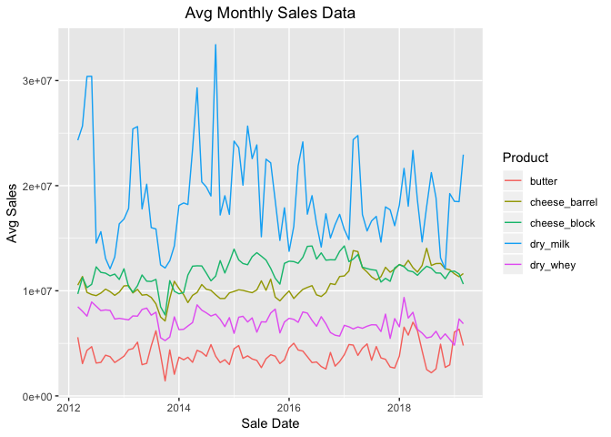

Dairy Sales Analysis and Forecast
================
Matthew Harris
04/07/2019

-   [Introduction](#introduction)
-   [Analysis Goals](#analysis-goals)
-   [Data Sources](#data-sources)
-   [Data Import](#data-import)
-   [Data Wrangling/Cleansing](#data-wranglingcleansing)
    -   [Data Inspection](#data-inspection)
    -   [Data Type Updates](#data-type-updates)
-   [EDA](#eda)
    -   [Outliers](#outliers)
    -   [Visualization](#visualization)
-   [Forecast Preparation](#forecast-preparation)
    -   [Time Period Transformation](#time-period-transformation)
    -   [ts Object Transformation](#ts-object-transformation)
-   [Forecast Comparison](#forecast-comparison)
-   [Forecast Application](#forecast-application)
-   [Conclusion](#conclusion)

Introduction
------------

This will be used as a sample to display some of my analytical capabilities in R. This project will demonstrate how useful R can be to perform analysis that is easy to reproduce and communicate. This is by no means an exhaustive demonstration of my proficiency with R, but should highlight common data analysis functions that I perform regularly.

Analysis Goals
--------------

Forecasts can be useful tools when trying to prepare for future events. In this work sample I will demonstrate some of my forecasting capabilities by analyzing U.S. dairy transactional data. I will begin the process by examining, cleaning, and transforming the data. Next I will perform some exploratory analysis to get a better understanding of the data. Last up I will run two models on the data, determine which one performs the best for this demonstration, and use that model to forecast 1 month price movements across all dairy products.

Data Sources
------------

The data used for this work sample can be found at the USDA [website.](https://mpr.datamart.ams.usda.gov/menu.do?path=Products\Dairy\All%20Dairy)

Data Import
-----------

Loading necessary packages for analysis.

``` r
library(readxl)
library(lubridate)
library(forecast)
library(tidyverse)
library(plotly)
library(scales)
library(timetk)
```

Loading csv file containing the data.

``` r
butter <- read_csv("Raw Data/Datamart-Export_DY_WK100-Butter Prices and Sales_20190407_042246.csv")
cheese_barrel <- read_csv("Raw Data/Datamart-Export_DY_WK100-500 Pound Barrel Cheddar Cheese Prices, Sales, and Moisture Content_20190407_042246.csv")
cheese_block <- read_csv("Raw Data/Datamart-Export_DY_WK100-40 Pound Block Cheddar Cheese Prices and Sales_20190407_042246.csv")
dry_milk <- read_csv("Raw Data/Datamart-Export_DY_WK100-Nonfat Dry Milk Prices and Sales_20190407_042246.csv")
dry_whey <- read_csv("Raw Data/Datamart-Export_DY_WK100-Dry Whey Prices and Sales_20190407_042246.csv")
```

Data Wrangling/Cleansing
------------------------

### Data Inspection

In order to begin the wrangling/cleansing process I need to know the characteristics of the data.

``` r
butter %>%
  glimpse()
```

    ## Observations: 1,830
    ## Variables: 5
    ## $ `Week Ending Date` <chr> "03/30/2019", "03/30/2019", "03/30/2019", "...
    ## $ `Report Date`      <chr> "04/03/2019", "04/03/2019", "04/03/2019", "...
    ## $ Date               <chr> "03/02/2019", "03/09/2019", "03/16/2019", "...
    ## $ `Weighted Prices`  <dbl> 2.2610, 2.2792, 2.2905, 2.2600, 2.2956, 2.2...
    ## $ Sales              <dbl> 6482983, 4109617, 3998746, 5098388, 3150773...

I repeated this process for the other tables. All of the tables have the same amount of observations, but the `cheese_barrel` table contains two extra columns. I want to join all of these tables by rows so I will want to remove those additional columns in order to keep the data consistent.

``` r
#Removes moisture, and un adjusted price from cheese barrel table
cheese_barrel %>%
  select(-4, -7) %>%
  rename("Weighted Prices" = "Weighted Price adjusted to 38% moisture") -> cheese_barrel
```

Now that I am sure that the column names and content match I can go through the process of combining the data by rows. I've chosen to accomplish this by placing all the tables into a list and looping through each table to create a product name column. This will allow me to identify each product type once they are combined.

``` r
#Creates vector of dairy product names to be used as values when the tables are combined
dairy_products <- c("butter", "cheese_barrel", "cheese_block", "dry_milk", "dry_whey")

#Combines the dairy product tables into a list that can be used to add a product name all at once
dairy_tables <- list(butter, cheese_barrel, cheese_block, dry_milk, dry_whey)

#Loops over each table to add the product name
i <- c()
for(i in 1:5) {
  
  dairy_tables[[i]] %>%
    mutate(product = dairy_products[i]) -> dairy_tables[[i]]
  
}

#Extracts each table from the list and binds them by rows
dairy_tables %>%
  lapply(data.frame) %>%
  bind_rows() -> dairy_data

#Removes unnecessary objects
rm(butter, cheese_barrel, cheese_block, dairy_tables, dry_milk, dry_whey, i)
```

### Data Type Updates

Now that all of the data are in one table I can begin the process of updating the column headers and making any necessary class changes.

``` r
#Updates the column headers
dairy_data %>%
  colnames() %>%
  tolower() %>%
  str_replace_all("\\.", "_") -> colnames(dairy_data)

#Examine the data structure to determine which variable classes need to be updated or removed
dairy_data %>%
  head(10)
```

    ##    week_ending_date report_date       date weighted_prices   sales product
    ## 1        03/30/2019  04/03/2019 03/02/2019          2.2610 6482983  butter
    ## 2        03/30/2019  04/03/2019 03/09/2019          2.2792 4109617  butter
    ## 3        03/30/2019  04/03/2019 03/16/2019          2.2905 3998746  butter
    ## 4        03/30/2019  04/03/2019 03/23/2019          2.2600 5098388  butter
    ## 5        03/30/2019  04/03/2019 03/30/2019          2.2956 3150773  butter
    ## 6        03/23/2019  03/27/2019 03/23/2019          2.2600 5094805  butter
    ## 7        03/23/2019  03/27/2019 03/16/2019          2.2905 3998746  butter
    ## 8        03/23/2019  03/27/2019 03/09/2019          2.2792 4109617  butter
    ## 9        03/23/2019  03/27/2019 03/02/2019          2.2610 6482983  butter
    ## 10       03/23/2019  03/27/2019 02/23/2019          2.2594 4360621  butter

``` r
dairy_data %>%
  str()
```

    ## 'data.frame':    9150 obs. of  6 variables:
    ##  $ week_ending_date: chr  "03/30/2019" "03/30/2019" "03/30/2019" "03/30/2019" ...
    ##  $ report_date     : chr  "04/03/2019" "04/03/2019" "04/03/2019" "04/03/2019" ...
    ##  $ date            : chr  "03/02/2019" "03/09/2019" "03/16/2019" "03/23/2019" ...
    ##  $ weighted_prices : num  2.26 2.28 2.29 2.26 2.3 ...
    ##  $ sales           : num  6482983 4109617 3998746 5098388 3150773 ...
    ##  $ product         : chr  "butter" "butter" "butter" "butter" ...

The data appear to have duplicate rows for the price and sales columns due to overlap of the `week_ending_date` and `report_date` columns. I only need one date column so I will remove those and filter only for distinct rows.

``` r
#Removes the week ending and reporting date columns. Updates the sale date column to class date
dairy_data %>%
  select(-week_ending_date, -report_date) %>%
  rename("sale_date" = "date") %>%
  mutate(sale_date = as_date(sale_date, format = "%m/%d/%Y", tz = "ETC")) %>%
  distinct() -> dairy_data
```

With that out of the way I can move to perform some exploratory data analysis on the data.

EDA
---

First up is a summary of the transformed data.

``` r
dairy_data %>%
  summary()
```

    ##    sale_date          weighted_prices      sales         
    ##  Min.   :2012-03-03   Min.   :0.2244   Min.   :       0  
    ##  1st Qu.:2014-04-05   1st Qu.:0.7547   1st Qu.: 6475652  
    ##  Median :2015-12-12   Median :1.5042   Median :10314002  
    ##  Mean   :2015-11-30   Mean   :1.3390   Mean   :11113304  
    ##  3rd Qu.:2017-08-26   3rd Qu.:1.7958   3rd Qu.:13703950  
    ##  Max.   :2019-03-30   Max.   :3.0130   Max.   :40800023  
    ##    product         
    ##  Length:4706       
    ##  Class :character  
    ##  Mode  :character  
    ##                    
    ##                    
    ## 

### Outliers

The `weighted_prices` column doesn't appear to contain any extreme outliers, but the `sales` column does appear to contain some extreme values when comparing the max value to 3 x IQR. Digging deeper shows that those extreme values are associated with the `dry_milk` product. Calculating the 3 x IQR metric again while filtering only for the `dry_milk` product still shows that the max value can be classified as extreme. I will keep these values in mind when assessing the results of model.

``` r
dairy_data %>%
  pull(weighted_prices) %>%
  IQR() * 3
```

    ## [1] 3.123225

``` r
dairy_data %>%
  pull(sales) %>%
  IQR() * 3
```

    ## [1] 21684895

``` r
dairy_data %>%
  group_by(product) %>%
  summarize(mn = min(sales), mx = max(sales))
```

    ## # A tibble: 5 x 3
    ##   product          mn       mx
    ##   <chr>         <dbl>    <dbl>
    ## 1 butter            0 12232908
    ## 2 cheese_barrel     0 15125416
    ## 3 cheese_block      0 16364481
    ## 4 dry_milk          0 40800023
    ## 5 dry_whey          0 11711511

``` r
dairy_data %>%
  filter(product == "dry_milk") %>%
  pull(sales) %>%
  IQR() * 3
```

    ## [1] 19261818

### Visualization

Next up is visualizing the data in its current form.

``` r
dairy_data %>%
  ggplot(aes(sale_date, weighted_prices, col = factor(product))) + geom_line() + 
  labs(title = "Weekly Price Data", x = "Sale Date", y = "Price", legend = "Product") + 
  theme(plot.title = element_text(hjust = 0.5)) + scale_color_discrete(name = "Product")
```


``` r
dairy_data %>%
  ggplot(aes(sale_date, sales, col = factor(product))) + geom_line() + 
  labs(title = "Weekly Sales Data", x = "Sale Date", y = "Sales", legend = "Product") + 
  theme(plot.title = element_text(hjust = 0.5)) + scale_color_discrete(name = "Product")
```


By visualizing the data it is easier to see the trends that they contain. With a glance you can see that `butter` usually commands the highest price and that `dry_milk` has experienced a steep price drop that has sustained over the past 5 years. It is also easy to see that `dry_milk` exhibits the highest fluctuations in weekly sales amounts.

Forecast Preparation
--------------------

### Time Period Transformation

Before I can start any of the forecasting process I need to transform the data to match the forecast time period. The data are currently described in a weekly format so they will need to be changed to a monthly format. I have chosen to utilize the sales weighted average price and the average sales for the monthly values.

``` r
dairy_data %>%
  mutate(sale_year = year(sale_date), sale_month = month(sale_date)) %>%
  group_by(sale_year, sale_month, product) %>%
  summarize(avg_weighted_price = weighted.mean(weighted_prices, sales, na.rm = TRUE),
         avg_sales = mean(sales, na.rm = TRUE)) %>%
  ungroup() %>%
  mutate(sale_date = as_date(paste(sale_month, "01", sale_year, sep = "/"), 
                             format = "%m/%d/%Y", tz = "ETC")) %>%
  mutate_at(c("avg_sales"), as.integer) -> avg_dairy_data

head(avg_dairy_data)
```

    ## # A tibble: 6 x 6
    ##   sale_year sale_month product      avg_weighted_pri… avg_sales sale_date 
    ##       <dbl>      <dbl> <chr>                    <dbl>     <int> <date>    
    ## 1      2012          3 butter                   1.45    5580953 2012-03-01
    ## 2      2012          3 cheese_barr…             1.54   10539426 2012-03-01
    ## 3      2012          3 cheese_block             1.51    9702205 2012-03-01
    ## 4      2012          3 dry_milk                 1.31   24319336 2012-03-01
    ## 5      2012          3 dry_whey                 0.599   8480689 2012-03-01
    ## 6      2012          4 butter                   1.44    3073366 2012-04-01

A good way to verify that the transformation was performed successfully is to visualize the data. The data should retain the same trends and pattern as the original dataset, just over different increments of time.

``` r
avg_dairy_data %>%
  ggplot(aes(sale_date, avg_weighted_price, col = factor(product))) + geom_line() + 
  labs(title = "Weekly Price Data", x = "Sale Date", y = "Avg Price", legend = "Product") + 
  theme(plot.title = element_text(hjust = 0.5)) + scale_color_discrete(name = "Product")
```


``` r
avg_dairy_data %>%
  ggplot(aes(sale_date, avg_sales, col = factor(product))) + geom_line() + 
  labs(title = "Weekly Price Data", x = "Sale Date", y = "Avg Sales", legend = "Product") + 
  theme(plot.title = element_text(hjust = 0.5)) + scale_color_discrete(name = "Product")
```



### ts Object Transformation

Now that the data is in a monthly format it needs to be converted into a ts object. ts objects are necessary to use functions from the `forecast` package.

``` r
avg_dairy_data %>%
  select(sale_date, avg_weighted_price, product) %>%
  spread(key = product, value = avg_weighted_price) -> avg_dairy_data_spread

avg_dairy_data_spread %>%
  pull(sale_date) %>%
  max() -> max_sale_date

avg_dairy_data_spread %>%
  pull(sale_date) %>%
  min() -> min_sale_date

avg_dairy_data_spread[, -1] %>%
  ts(start = c(year(min_sale_date), month(min_sale_date)), end = c(year(max_sale_date), 
                                                                   month(max_sale_date)),
     frequency = 12) -> avg_dairy_ts

rm(avg_dairy_data, avg_dairy_data_spread, dairy_data)
```

Forecast Comparison
-------------------

There are two classes of forecast models that I am looking to compare: ARIMA(autoregressive integrated moving average) and ETS(exponential smoothing) models. I want to see how these forecast methods perform for each dairy product over varying forecast horizons. I will use for loops to automate the process of testing the forecasts methods. I will be using the RMSE(root mean squared error) metric for this comparison and evaluating the models over a 1 to 8 month forecast horizon.

``` r
n_forecast <- 8
p <- c()
n <- ncol(avg_dairy_ts)
i <- c()
model_results <- data.frame("product" = NA, "ARIMA_RMSE" = NA, "ETS_RMSE" = NA, "forecast_n" = NA)

for(p in 1:n_forecast) {

for(i in 1:n) {
  
  train <- window(avg_dairy_ts[, i], end = c(year(max_sale_date - months(p)), 
                                             month(max_sale_date - months(p))))
  test <- window(avg_dairy_ts[, i], start = c(year(max_sale_date - months(p - 1)), 
                                              month(max_sale_date - months(p - 1))))
  
  fit_arima <- auto.arima(train)
  fc1 <- forecast(fit_arima, h = p, level = c(95))
  
  fit_ets <- ets(train)
  fc2 <- forecast(fit_ets, h = p, level = c(95))
  
  dairy_products[i] -> model_results[5*(p-1) + i, 1]
  accuracy(fc1, avg_dairy_ts[, i])[4] -> model_results[5*(p-1) + i, 2]
  accuracy(fc2, avg_dairy_ts[, i])[4] -> model_results[5*(p-1) + i, 3]
  p -> model_results[c((5*(p-1) + 1):(5*(p-1) + 5)), 4]
  
}

}

rm(i, n, p, test, train, n_forecast, fc1, fc2, fit_arima, fit_ets)

model_results %>%
  gather(key = "metric", value = "error", -product, -forecast_n) %>%
  ggplot(aes(product, error, fill = metric)) + geom_col(position = "dodge") +
  labs(title = "ARIMA vs. ETS", x = "Product", y = "RMSE") + 
  scale_fill_discrete(name = "Forecast Method") +
  theme(axis.text.x = element_text(angle = 45, hjust = 1), plot.title = element_text(hjust = 0.5)) + 
  facet_wrap(~forecast_n)
```


Visualizing the model results allow me to see that the ARIMA models performs better for most of the dairy products, where the forecast horizon is less than 6 months. The ETS models appear to perform better for forecast further into the future. There are other methods to evaluate the performance of a forecast model but this will work for this exercise. Given the goals of this work sample I will choose to utilize the ARIMA model output from the `auto.arima()` function.

Forecast Application
--------------------

Now that I know what type of model I would like to use I can apply it to the data that I currently have. I will revisit this dataset in the future, but for now I will backtest the data in 1 month increments. This will allow me to simulate how the model would perform when forecasting for new prices. To accomplish this I will create for loops similar to the ones that I used to evaluate the models’ performances. This time I will restrict my forecast horizon to 1 and record the predictions made by the model rather than the error metric. I have also chosen to convert the `avg_dairy_ts` back to a tibble format so that I can graph the final results using `ggplot`.

``` r
n_backtest <- 8

tk_tbl(avg_dairy_ts, rename_index = "sale_date") %>%
  mutate(sale_date = zoo::as.Date(sale_date, frac = 0)) %>%
  gather(key = product, value = price, -sale_date) %>%
  mutate(value_type = "actual") -> avg_dairy_tbl

pred_table <- data.frame("sale_date" = date("1/1/1"), "product" = NA, "price" = NA, "value_type" = NA)

p <- c()
n <- ncol(avg_dairy_ts)
i <- c()

for(p in 1:n_backtest) {

for(i in 1:n) {
  
  train <- window(avg_dairy_ts[, i], end = c(year(max_sale_date - months(p)), 
                                             month(max_sale_date - months(p))))
  test <- window(avg_dairy_ts[, i], start = c(year(max_sale_date - months(p - 1)), 
                                              month(max_sale_date - months(p - 1))))
  
  fit_arima <- auto.arima(train)
  fc1 <- forecast(fit_arima, h = 1, level = c(95))
  
  date(max_sale_date - months(p - 1)) -> pred_table[5*(p-1) + i, 1]
  dairy_products[i] -> pred_table[5*(p-1) + i, 2]
  as.vector(fc1$mean) -> pred_table[5*(p-1) + i, 3]
  "pred" -> pred_table[5*(p-1) + i, 4]
  
}
}
```

With the predictions stored I can now bind them to the original data to analyze and visualize the price differences. I've chosen to facet the data based upon the product so that it is easier to see the actual prices and predictions for each plot.

``` r
avg_dairy_tbl %>%
  bind_rows(pred_table) %>%
  filter(sale_date >= date(max_sale_date - months(p - 1))) %>%
  spread(key = value_type, value = price) %>%
  mutate(abs_perc_err = abs(pred - actual) / actual, sq_err = (pred - actual)^2) %>%
  group_by(product) %>%
  summarize(mape = percent(mean(abs_perc_err)), rmse = sqrt(mean(sq_err)))
```

    ## # A tibble: 5 x 3
    ##   product       mape    rmse
    ##   <chr>         <chr>  <dbl>
    ## 1 butter        1.53% 0.0470
    ## 2 cheese_barrel 6.04% 0.104 
    ## 3 cheese_block  3.83% 0.0745
    ## 4 dry_milk      2.38% 0.0270
    ## 5 dry_whey      3.92% 0.0190

``` r
avg_dairy_tbl %>%
  bind_rows(pred_table) %>%
  ggplot(aes(sale_date, price, color = value_type)) + geom_line() +
  labs(title = "Actual vs. Predictions", x = "Price", y = "Sale Date") +
  scale_color_discrete(name = "Value Type") +
  theme(axis.text.x = element_text(angle = 45, hjust = 1), plot.title = element_text(hjust = 0.5)) +
  facet_wrap(~product)
```


I've chosen to summarize the error of each product for the forecasted months by computing their MAPE(mean absolute percentage error) and RMSE. The two error metrics aren't necessarily comparable between each other, but they can be used to identify which products that the chosen model perform better on. It's clear that the model is less accurate at predicting price movements for `cheese_barrel` sales. This could be remedied by using a different model for this specific product.

Conclusion
----------

The forecasting tools within R make it easy to create, test, and examine models for predicting future outcomes. Although I stopped with a solution that utilizes the same model for each dairy product, there are many ways to that this script could be altered to better suit potential business needs. I hope that this sample has demonstrated my abilities not only with forecasting in R, but also the common tasks of data cleansing, wrangling, and visualization needed to perform and communicate any type of analysis.
